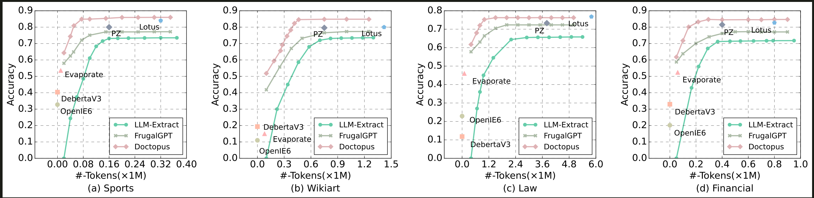

<div align= "center">
    <h1>Doctopus: Budget-aware Structural Table Extraction from Unstructured Documents</h1>
</div>
<p align="center">
  <a href="#-struct">Folder Structure</a> •
  <a href="#-getstart">Getting Start</a> •
  <a href="#-datasets">Datasets</a> •
</p>


<br>
<div align="center">

<!-- <iframe src="imgs/framework.jpg" width="100%" height="600px"></iframe> -->
</div>
<br>
To fulfill the potential great value of unstructured documents, it is
critical to extract structural data (e.g., attributes) from them, which
can benefit various applications such as analytical SQL queries
and decision-making. Multiple strategies, such as pre-trained language models (PLMs), can be employed for this task. However,
these methods often struggle to achieve high-quality results, particularly when dealing with attribute extraction that requires intricate
reasoning or semantic comprehension. Recently, large language
models (LLMs) have proven to be effective in extracting attributes
but incur substantial costs caused by token consumption, making
them impractical for large-scale document set.
To best trade off quality and cost, we present Doctopus, a system designed for accurate attribute extraction from unstructured
documents with a user-specified cost constraint. Overall, Doctopus
combines LLMs with non-LLM strategies to achieve a good tradeoff. First, the system employs an index-based approach to efficiently
identify and process only relevant text chunks, thereby reducing the
LLM cost. Afterwards, it further estimates the quality of multiple
strategies for each attribute. Finally, based on the cost and estimated quality, Doctopus dynamically selects the optimal strategies
through budget-aware optimization. We have built a comprehensive
benchmark including 4 document sets with various characteristics,
as well as the ground truth values that are manually labeled using 1000 human hours. Extensive experiments on the benchmark
have demonstrated that compared with state-of-the-art baselines,
Doctopus can improve the quality by 11% given the same cost
constraint.
<span id="-struct"></span>

## Folder Structure


```

Doctopus
├── Utils                     # lib for functions
│   ├── Group_Knapsack_Algorithm.py           # groupbag algorithms
│   ├── metic.py              # the metic of textF1
│   ├── similiar_chunk.py     # the most similiar chunks
|   └── prompt.py             # the prompt for LLM 
├── cluster                   # Directory for cluster algorithms
│   ├── k_means.py            # k-means algorithms
│   ├── text2emb.py           # embedding for text
|   └──tuple2emb.py           # embedding for tuple
├── var.py                    # confg information for datasets
├── main.py                   # Main script controlling the system's overall flow
├── README.md                 # Project overview and instructions
└── requirements.txt          # Python dependencies for the project


train distilbert model
PLM
├── eval.py                   #  evaluate the result of exist model 
├── eval_LLM.py               #  eval the result of LLM
├── predict.py                # the output of exist mmodel 
├── tain.py                   # train exist model 
└── util.py                   # the functions of exist model

```
<!-- 
The full version of the technical report is [here](./Full_version.pdf).  -->

<br>
<span id="-getstart"></span>

##   Getting Started

This is an example of how to set up DOCTOPUS locally. To get a local copy up, running follow these simple example steps.

### Prerequisites

To install the required packages, you can create a conda environment:

```sh
conda create --name DOCTOPUS python=3.9

then use pip to install -r requirements.txt

pip install -r requirements.txt
```

The following commands will quickly get you started with our optimization code.
```sh
python main.py
```


And we have provided a complete demo process to help you train the exist model 

 

```sh
python tain.py
```

### Run DOCTOPUS

**Step1: fill up your information**

You first need to fill in the following custom variables in `main.py` and provide the path to your custom dataset documents.
```python
#main.py
OPENAI_KEY = 'Your OPENAI KEY'
schema = "attributes which you want to abtract "
file_lake_dir = "Your directory of the dataset"      
result_dir = "Your directory of the result "            
file_candidate_dir = "Your directory of the candidate files"  # Your file_candidate_dir directory must contain two subfolders: /candi and /key. These subfolders can be empty.
```
```python
#example filling
OPENAI_KEY = 'sk-xxxxxxxxxxxxxxxxxxxxxxxxxx'
schema = " name, age, team  birth_country"
sehcel_description = 
"""
name : name of NBA player
age  : NBA player's age
team : NBA player's team
birth_country: the birth country of the NBA player
"""
file_lake_dir = "./NBAplayer/"            # the directory of the data lake
result_dir = "./result/"                 # the directory of the result
file_candidate_dir = "./candidate/" # the directory of the candidate files
```

**Step2: run main.py**

```sh
python main.py
```

**Step3: result**

The `output.csv` file is located in your custom folder.

## Datasets

<!-- <span id="-datasets"></span> -->
<!-- ##     -->
### Wikiart
Wikiart includes 1,000 documents describing the biographies of
various artists. Each document contains 714 tokens on average, and
8 attributes.
### Financial
Financial includes 1,500 documents that provide details about various companies. On average, each document comprises 258 tokens
and 8 attributes.
### Sports
Sports consists of 100 Wikipedia pages about NBA players. We
transform each webpage into a document that includes only text.
Each document typically includes 1,645 tokens and provides information on 10 attributes.
### Law
Law includes 3,000 case reports from the Federal Court of Australia
covering the years 2006 to 2009, from which we sample 600 documents. On average, each document contains 5,926 tokens and 9
attributes.

### Dataset address
[access the dataset](https://drive.google.com/drive/folders/1_hgDv0DSp1B7pBR2lRYaRohHrpc2lpAb?usp=sharing)

## Prompts for Large Language Models

The following prompts are used by **Doctopus** for various tasks in attribute extraction and reference generation. These prompts are also available in the `prompt.py` file in the GitHub repository for full details.

### Validation Set Construction

We use large language models (LLMs) to construct the validation set (including 10% of the documents from the original dataset) and the corresponding ground truth. Specifically, we use LLMs to scan the entire document in the validation set to extract attribute values and the corresponding references. The extracted results are used for quality estimation. The prompt used is as follows:

```plaintext
You are an assistant proficient in text comprehension, tasked with extracting specified attribute values from the following text and indicating the supporting chunks for these values.

Task Description:
- Extract the value of each attribute from the text.
- For each attribute, return a dictionary containing:
  - "Value": The corresponding value of the attribute found in the text.
  - "Supporting Chunks": The text that explicitly mentions this value.
  - If there are multiple chunks, return them as a list. Be sure to include all relevant chunks, including those that indirectly infer the attribute value and do not include any invalid characters or formats.

Requirements:
- If an attribute is not explicitly mentioned in the text, return:
  - "Value": ""
  - "Supporting Chunks": ""
- Ensure you match and extract attributes in the order provided. If an attribute value corresponds to multiple chunks, return them as a list.

Here are the input text and attribute list:
Text: {text}
Attribute List: {attributes}

Please extract the attribute values and return the results in JSON format.
```

### Reference Generation

To enhance the diversity of references, we employ LLMs to directly produce references in a two-step generation process:

1. **Attribute Value Generation**: First, we prompt LLMs to generate a set of potential candidate values for the target attribute (e.g., generating "Portrait," "Landscape," and "Abstract" as potential values for the attribute Genre).
2. **Reference Generation**: For each candidate value generated in the first step, we further instruct LLMs to synthesize multiple references where the value can be extracted. For example, for the value "Portrait," LLMs might produce sentences like "His early works primarily featured oil-based portrait paintings."

The prompt for this step is as follows:

```plaintext
For a given attribute: {attribute}, do the following:

1. Generate {h} potential values for the attribute {attribute}.
   - For example, if the attribute is "name", generate {h} possible names like: John, Mike, etc.

2. For each potential attribute value generated in step 1, create {h} natural sentences (references) where the attribute value can be extracted.
   - The references should mimic realistic usage of the attribute value by humans.
   - For instance, if the attribute value is "John", generate sentences like: "John is 11 years old", "My friend John likes to play basketball", etc.

3. Output the results in a JSON format:
   - The keys are the generated attribute values.
   - The corresponding values are lists containing the {h} generated references for each attribute value.

Here's an example of the desired JSON output format for the "name" attribute:

{
  "John": [
    "John is 11 years old",
    "My friend John likes to play basketball",
    ...
  ],
  "Mike": [
    "I met Mike at the party last weekend",
    "Mike works as a software engineer at Google",
    ...
  ],
  ...
}
```

### Attribute Value Extraction

We use LLMs to extract values from text chunks in both quality estimation and budget-aware accuracy optimization. The prompt used is as follows:

```plaintext
The content of the file is as follows:

{file_content}

Please extract the following attributes from the above content:

{attributes_list}

Return the result in JSON format, for example: {"Attribute1": "Value1", "Attribute2": "Value2", ...}.

If an attribute cannot be found, set its value to "".
```

These prompts are available in the GitHub repository under the `Utils/prompt.py` file for further details.

##  Result
Our experimental results are as follows:
<br>
<div align="center">

</div>
<br>

The average time consumed to process each document:
<br>
<div align="center">

</div>
<br>

